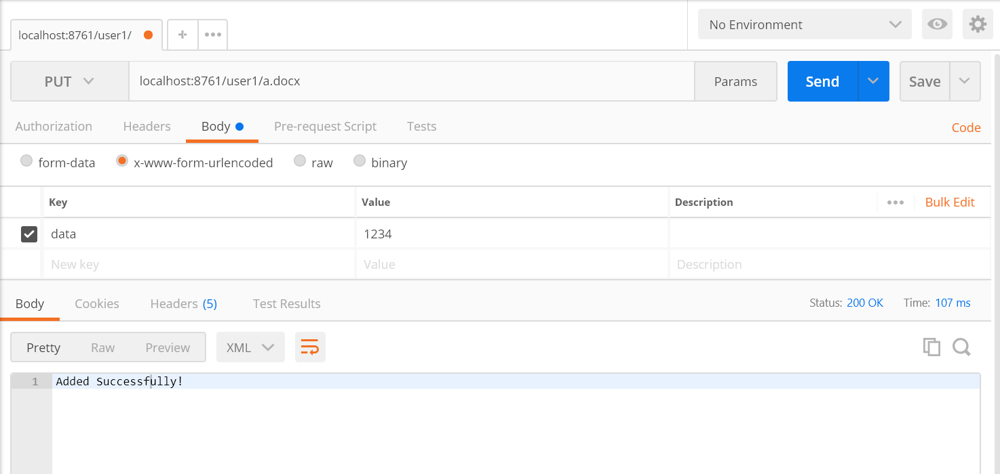
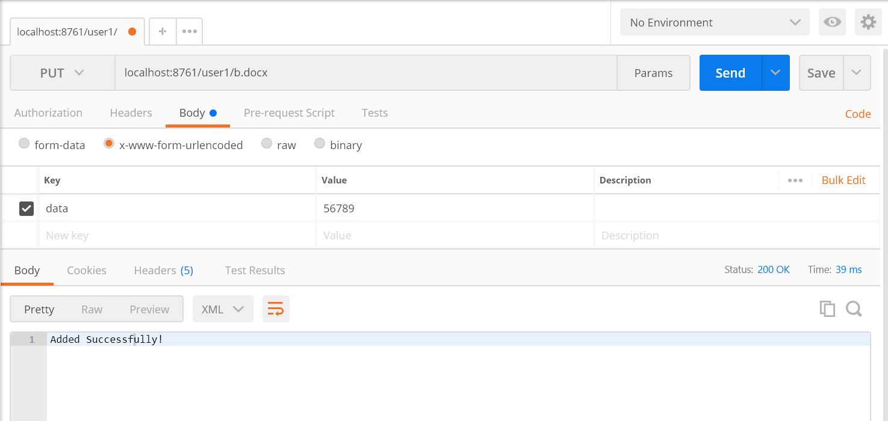
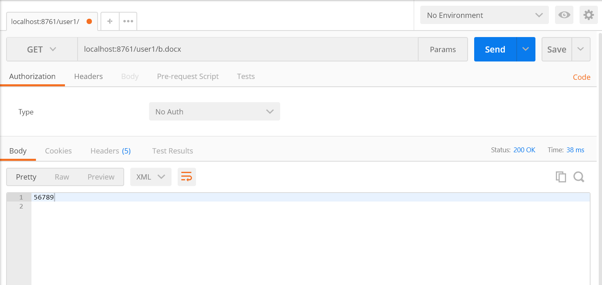
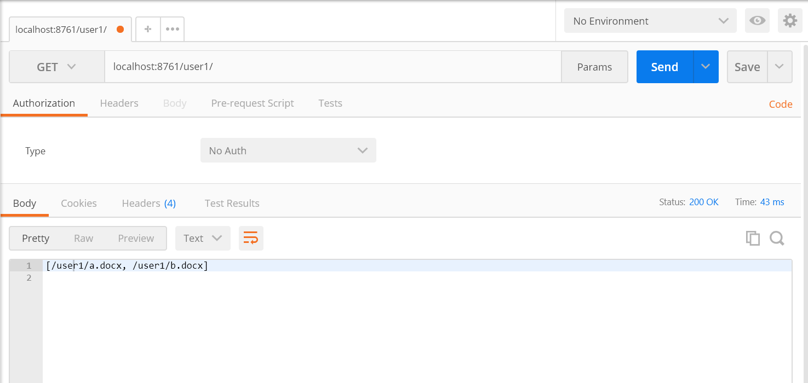
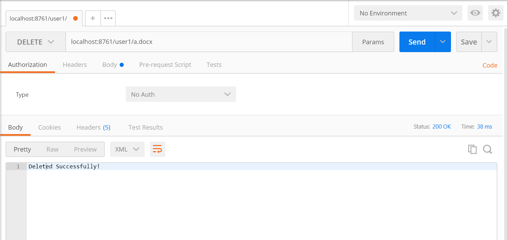
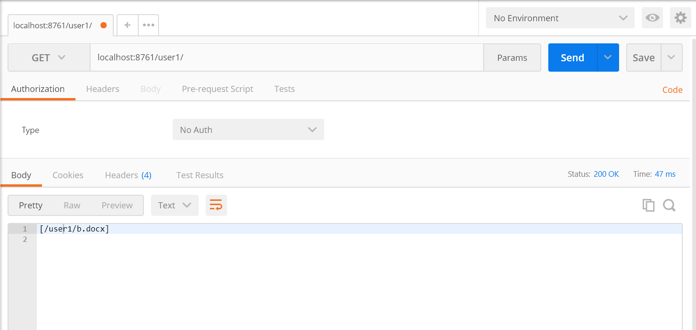

# 一个基于微服务架构的分布式文件系统

## 运行方法
文件夹内有`NameNode`和`DataNode`两个工程文件，`NameNode`使用`mvn spring-boot:run`运行，`DataNode`使用`mvn spring-boot:run -Dserver.port=xxxx`运行，`xxxx`为端口号。

## 整体设计
系统分为两个部分：`NameNode`结点和`DataNode`结点，前者是Eureka服务器，后者是Eureka客户端，可能会有多个。二者都是基于spring-boot，按照MVC风格进行架构，并提供REST风格的接口，其中`NameNode`与用户直接交互，用户可以通过发送`PUT`、`GET`和`DELETE`请求实现上传、查看和删除功能，`NameNode`会将存储内容切分为多个模块，存储到`DataNode`中。`NameNode`使用Listener监听Eureka服务器的事件，在`DataNode`结点加入或离开时，可以进行相应的处理。
目前实现的功能：
1. 通过`GET`请求获取文件系统/目录内容；
2. 通过`GET`请求获取文件内容详情；
3. 通过`PUT`请求上传文件到指定路径；
4. 通过`DELETE`请求删除指定目录下的指定文件；
5. `DataNode`服务可弹性扩展，每次启动一个`DataNode`服务时，其可被`NameNode`发现并被纳入整个系统；
6. `NameNode`选择`DataNode`存储内容时为随机选取，尽量维持负载均衡。

因为时间和个人能力所限，目前还未实现的功能：
1. 没有实现真正意义上、支持所有文件类型的“文件存储”，其实质上只是字符串的存取和删除；
2. `NameNode`检查各`DataNode`健康状态，模拟`DataNode`下线时`NameNode`自动在其他`DataNode`上复制（迁移）该下线服务原本保存的数据块的功能未完全实现（不可用）；
3. 没有写前端页面；
4. 文件系统的数据结构有些简陋，称不上是真正的“系统”。
## 运行截图
1. 通过`/user1/a.docx`上传文件

2. 通过`/user1/b.docx`上传文件

3. 通过`/user1/b.docx`查看文件内容

4. 通过`/user1/`查看目录下所有文件

5. 通过`/user1/a.docx`删除文件

6. 通过`/user1/`查看目录下所有文件

## 参考致谢
主要参考材料：
1. [Spring Boot基础教程](http://blog.didispace.com/Spring-Boot%E5%9F%BA%E7%A1%80%E6%95%99%E7%A8%8B/)
2. [使用Spring Boot上传文件](http://www.ityouknow.com/springboot/2018/01/12/spring-boot-upload-file.html)
3. [注册中心Eureka](http://www.ityouknow.com/springcloud/2017/05/10/springcloud-eureka.html)

这次作业因为时间很紧、任务繁重，所以做得很是不容易，lwb同学在设计上给了我许多有益的建议，在此表示万分感谢，同时sjj同学、xyz同学、xzr同学等也给了我一些细节上的指导，在此一并感谢。